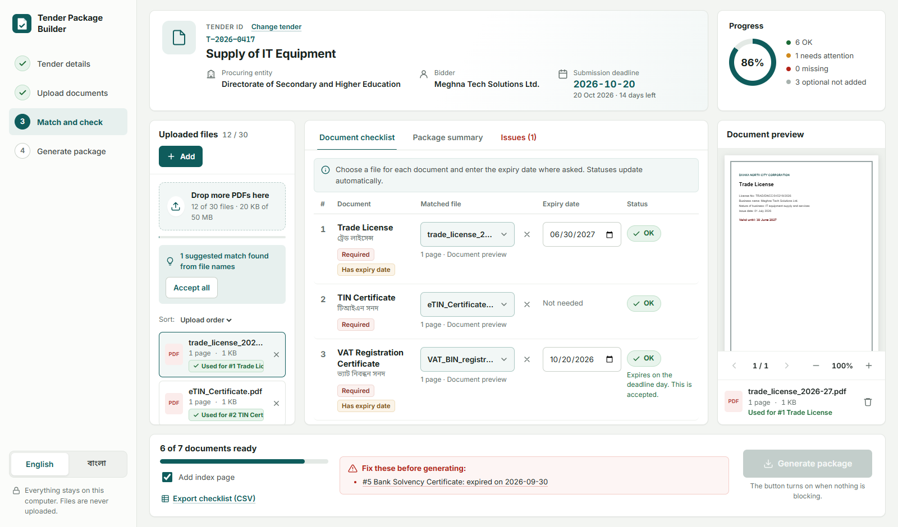

# Tender Package Builder

A frontend-only web app that turns a tender's `requirements.json` and a set of PDF files into one checked, correctly ordered submission PDF named `<tender_id>_Package.pdf`. Everything runs in the browser: no backend, no uploads, no analytics.

- **Live site:** _see the submission portal / repository description_
- **Final package from the sample pack:** [`output/T-2026-0417_Package.pdf`](output/T-2026-0417_Package.pdf)
- **Screenshots:** [`screenshots/`](screenshots/)



## How to run

```bash
npm install
npm run dev        # http://localhost:5173
npm test           # Vitest unit tests (status engine, duplicates, reducer, parser, PDF builder)
npm run build      # type-check + production build into dist/
npm run preview    # serve the production build
```

Requires Node 20+ and the latest Google Chrome.

## How to use

1. **Open requirements.json** (or click *Try the sample tender*). The tender details and the checklist, sorted by `order`, appear.
2. **Add PDFs** with the *Add* button or by dropping them anywhere on the page (up to 30 files, 50 MB total).
3. **Match** each document to a file using the picker in its row. Suggested matches from file names can be accepted with one click.
4. **Enter expiry dates** where the row asks for one. Statuses update immediately.
5. When the bottom bar says *All set*, click **Generate package**. The PDF downloads as `<tender_id>_Package.pdf`.

The language toggle (English / বাংলা) is in the sidebar. It switches the whole interface, is remembered between visits and never resets your work.

## What the app checks

| Status | When | Blocks? |
| --- | --- | --- |
| Missing | Required document, no file | Yes |
| Expiry date needed | Has expiry, file matched, no date | Yes |
| Expired | Expiry date is before the submission deadline | Yes |
| Not provided | Optional document, no file | No |
| OK | File matched and (no expiry needed, or date is on/after the deadline) | No |

A document that expires on the deadline day is OK. Every blocking reason is listed under the Generate button; clicking one scrolls to that row and highlights it.

Uploads are checked for extension, MIME type and the `%PDF` signature. Files with identical content (SHA-256) are tagged as duplicates with a shared colour and cannot be matched to two different documents. Password-protected and damaged PDFs are flagged on their card and cannot be matched.

## The generated PDF

- **Page 1:** English cover with tender ID, title, procuring entity, bidder, submission deadline, the generation date (local date, YYYY-MM-DD) and a numbered list of included documents.
- **Page 2 (optional, on by default):** index with the starting page of each document. Bangla titles are rendered with the browser's own text shaping and embedded as images, so conjuncts display correctly.
- **Then** every included document in `order`, all pages in their original order. Optional documents without a file are skipped.
- **Footer on every page:** `<tender_id> | Page X of Y`, Helvetica 9.5pt dark grey. Each source page is copied onto a new page that is 36pt taller, with the original drawn above the footer margin, so the footer never covers content. Page sizes, landscape pages, CropBox and `/Rotate` are respected.

## Problems found in the sample pack and how the app handles them

The official sample pack was not available in this workspace while building, so the app was tested against a generated pack (`npm run sample`, written to `public/sample/`) that contains the same kinds of problems the brief describes. The table below lists them. When the official pack is used, the app surfaces the same categories in the same way.

| Problem | File(s) | How the app handles it | Resolution in `output/` |
| --- | --- | --- | --- |
| Not a PDF (Word file) | `company_profile.docx` | Rejected on upload with a toast naming the file | Not used |
| Image renamed to `.pdf` | `office_photo.pdf` | Rejected: no `%PDF` signature | Not used |
| Damaged PDF | `audited_financial_statement_2025.pdf` | Card shows "Damaged file", disabled in every picker | Optional document left out (Not provided) |
| Password-protected PDF | `power_of_attorney_protected.pdf` | Card shows "Password-protected", disabled in every picker | Optional document left out (Not provided) |
| Same content, different names | `experience_certificate_BCC.pdf` = `scan_0042.pdf` | Both tagged "Duplicate A"; once one is matched the other is disabled with the reason | `scan_0042.pdf` removed, the named file used once |
| Expired document | `bank_solvency_certificate.pdf` (valid until 2026-09-30, deadline 2026-10-20) | Status Expired with reason, Generate disabled | Replaced by `bank_solvency_certificate_renewed.pdf` (valid until 2026-12-31) |
| Expires on the deadline day | `VAT_BIN_registration.pdf` (valid until 2026-10-20) | OK, with a note that same-day expiry is accepted | Included |
| Unsorted requirements with gaps in `order` | `requirements.json` (orders 1-6, 8-10, 12) | Sorted by `order`; numbering shown as in the file | Package follows `order` |
| Mixed page sizes and a rotated scan | `Technical_Proposal.pdf` (landscape page, `/Rotate 90` page) | Each page keeps its own size and orientation | Pages 12-13 of the package |

Expiry dates were entered only as printed on each document. No dates were invented.

## Decisions

- **Stack:** Vite, React 19, TypeScript, `pdf-lib` (merge, cover, footer), `pdfjs-dist` (page counts, preview, thumbnails). Plain CSS with variables; Inter and Noto Sans Bengali via Fontsource.
- **State:** one `useReducer` (`src/store.ts`). It enforces the rules itself: one file per document, one document per file, a change or unmatch clears the expiry date, duplicates and bad files cannot be matched.
- **Pure logic in `src/lib/`:** `status.ts`, `duplicates.ts`, `requirements.ts`, `buildPackage.ts`, `pdfInfo.ts`, `automatch.ts`, `csv.ts`, `dates.ts`. Unit tested with Vitest.
- **Lenient but safe parsing:** unknown fields are ignored, a missing `title_bn` falls back to `title_en`, numeric strings are accepted for `order`, and every problem is reported in plain language.
- **Protected PDFs are rejected**, even when they open without a password, because pdf-lib cannot copy encrypted content streams and the output would be blank.
- **All strings** live in one typed dictionary (`src/i18n.ts`). Bangla mode also uses Bangla numerals and dates.
- **Accessibility:** labelled inputs, keyboard-only matching (native selects), visible focus rings, `aria-live` regions for toasts and status changes, 44px controls, colour + icon + text for every status.

## Bonus features

Bad-file detection, index page, CSV export (UTF-8 with BOM for Excel), auto-match suggestions confirmed with one click, Bangla on the index page, document preview, package summary tab.

## Project structure

```
src/
  lib/            pure logic + tests
  components/     Sidebar, TenderHeader, FilePanel, FileCard, Checklist, RequirementRow, Preview, GenerateBar, StatusChip, Toasts
  i18n.ts         typed EN/BN dictionary
  store.ts        reducer
  App.tsx
scripts/
  make-sample.mjs   builds the test pack in public/sample/
  cdp.mjs           headless Chrome driver used for end-to-end checks and screenshots
  scenarios/        end-to-end scenarios (full flow, edge cases, PDF page rendering)
output/           final package and checklist CSV
screenshots/      UI screenshots
```
